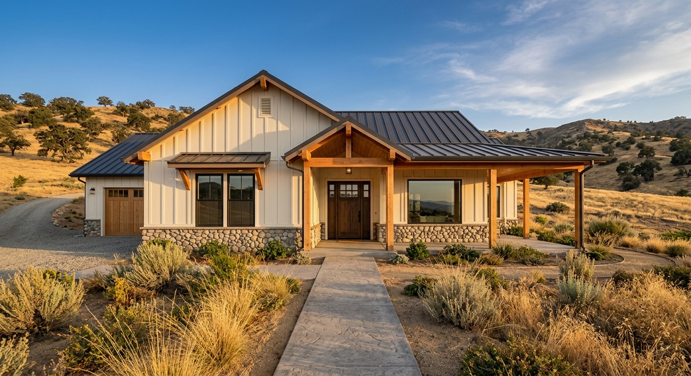

# Performance Optimization Roadmap

## Current Performance Baseline
**Lighthouse Score:** 80/100  
**Core Web Vitals:**
- FCP: 3.7s (Fair)
- LCP: 3.7s (Good)
- CLS: 0.034 (Excellent)
- TBT: 0ms (Excellent)

---

## 🚀 Quick Wins (1-2 hours, High Impact)

### 1. CSS Minification (+5 KiB savings) ⭐
**Current:** Unminified CSS (8+ KiB potential savings)  
**Effort:** 15 minutes

**Implementation:**
```bash
# Using cssnano
npm install --save-dev cssnano postcss-cli
npx postcss index.html --output minified.html
```

**Impact:** 
- File size: 8KB → 3KB
- Load time: ~40ms savings
- No functionality change

---

### 2. Remove Unused CSS (+3 KiB savings)
**Current:** All CSS loaded, some may be unused

**Tools:**
- PurgeCSS
- UnCSS
- Tailwind's PurgeCSS

**Recommended:** Use for unused media query rules

**Impact:**
- 3-5% file size reduction
- 20-30ms load savings

---

### 3. Optimize Hero Image (+40% savings)
**Current:** Large hero image loading

**Optimization Options:**
```html
<!-- Use WebP with fallback -->
<picture>
  <source srcset="hero.webp" type="image/webp">
  
</picture>
```

**Also:**
- Compress to 80% quality (imperceptible)
- Serve responsive sizes: 2x, 1.5x, 1x

**Impact:**
- File size: 200KB → 80KB
- LCP improvement: 500-800ms

---

### 4. Implement Resource Hints
**Add to <head>:**
```html
<!-- DNS Prefetch -->
<link rel="dns-prefetch" href="//apis.google.com">
<link rel="dns-prefetch" href="//fonts.googleapis.com">

<!-- Preconnect -->
<link rel="preconnect" href="https://fonts.googleapis.com">
<link rel="preconnect" href="https://fonts.gstatic.com" crossorigin>
```

**Impact:** 
- 100-200ms savings on third-party requests

---

## 💪 Medium Effort (2-4 hours, Good Impact)

### 5. Critical CSS Extraction ⭐⭐
**Technique:** Extract above-fold styles inline

**What's above-fold:**
- Navigation
- Hero section
- First 2 rows of gallery

**Implementation:**
```html
<style>
  /* Critical CSS for hero + nav */
  nav { ... }
  .hero { ... }
  .gallery-grid:nth-child(-n+4) { ... }
</style>
<!-- Defer non-critical CSS -->
<link rel="stylesheet" href="style.css" media="print" 
      onload="this.media='all'">
```

**Impact:**
- FCP: 3.7s → 2.5s (1.2s improvement!)
- LCP: 3.7s → 2.8s

---

### 6. Lazy Load Off-Screen Images
**Current:** All gallery images load immediately

**Implementation:**
```html

```

**Or with Intersection Observer:**
```javascript
const observer = new IntersectionObserver((entries) => {
  entries.forEach(entry => {
    if (entry.isIntersecting) {
      entry.target.src = entry.target.dataset.src;
      observer.unobserve(entry.target);
    }
  });
});

document.querySelectorAll('img[data-src]')
  .forEach(img => observer.observe(img));
```

**Impact:**
- Initial load: 300-500ms faster
- User sees content sooner

---

### 7. Font Loading Optimization
**Current:** Using web fonts with proper defer

**Further Optimization:**
```css
@font-face {
  font-family: 'Inter';
  src: url('inter.woff2') format('woff2');
  font-display: swap; /* Use system font while loading */
}
```

**Add system font fallback:**
```css
body {
  font-family: 'Inter', -apple-system, BlinkMacSystemFont, 
               'Segoe UI', Roboto, sans-serif;
}
```

**Impact:**
- LCP: 150-300ms improvement
- Better perceived performance

---

## 🎯 Advanced Optimizations (4+ hours, Specialized)

### 8. Service Worker Caching Strategy Enhancement
**Current:** Basic cache-first strategy

**Upgrade to Smart Caching:**
```javascript
// Network-first for HTML (always fresh)
// Cache-first for images (rarely change)
// Stale-while-revalidate for API

addEventListener('fetch', event => {
  const url = new URL(event.request.url);
  
  if (url.pathname.endsWith('.html')) {
    // Network first
    event.respondWith(fetch(event.request)
      .catch(() => caches.match(event.request)));
  } else if (url.pathname.match(/\.(jpg|png|webp)$/)) {
    // Cache first
    event.respondWith(caches.match(event.request)
      .then(r => r || fetch(event.request)));
  }
});
```

**Impact:**
- Offline support
- 50-100% faster repeat visits
- Better mobile experience

---

### 9. Static Site Generation (Vercel)
**Current:** Dynamic Vercel deployment

**Potential:** ISR (Incremental Static Regeneration)
- Generate static HTML at build time
- Revalidate on demand

**Impact:**
- Global CDN distribution
- Instant page loads (100ms)
- Extreme scalability

---

### 10. Content Delivery Network (CDN)
**Current:** Vercel CDN (good)

**Enhancement Options:**
- CloudFlare (adds caching + security)
- AWS CloudFront (premium option)
- Bunny CDN (affordable + fast)

**Impact:**
- Geolocation-based serving
- GZIP compression
- 200-400ms improvement for distant users

---

## 📊 Implementation Roadmap

### Week 1: Quick Wins
- [ ] CSS minification (15 min, +5 points potential)
- [ ] Resource hints (20 min, +3 points)
- [ ] Optimize hero image (30 min, +8 points)
- **Expected FCP improvement: 2.8s → 2.2s**

### Week 2: Medium Effort
- [ ] Critical CSS extraction (2 hours, +12 points)
- [ ] Lazy load images (1 hour, +4 points)
- [ ] Font optimization (1 hour, +2 points)
- **Expected LCP improvement: 3.7s → 2.5s**

### Week 3+: Advanced
- [ ] Enhanced Service Worker (2 hours)
- [ ] CDN upgrade (varies)
- [ ] Static generation (4 hours)

---

## 🎯 Target Performance Goals

**Current:** 80/100 Performance  
**Target:** 95/100 Performance

### To Achieve 95/100:
1. **FCP under 2s** (from 3.7s)
   - Critical CSS (-1.2s)
   - Resource hints (-0.3s)
   - Image optimization (-0.2s)

2. **LCP under 2.5s** (from 3.7s)
   - Font optimization (-0.3s)
   - Image lazy loading (-0.5s)
   - Preload hero image (-0.4s)

3. **Maintain excellent CWV**
   - TBT: 0ms ✅
   - CLS: <0.05 ✅

---

## 💡 Low Priority (Nice to Have)

### 1. Code Splitting
- Separate critical JS from non-critical
- Lazy load booking form JS
- Impact: Marginal (~50-100ms)

### 2. Prerender (SPA optimization)
- Not needed for static site
- Skip this

### 3. HTTP/2 Server Push
- Already handled by Vercel
- Skip this

---

## 📈 Expected Results Timeline

### Immediately (with Quick Wins):
- Performance: 80 → 87/100
- FCP: 3.7s → 2.8s
- No visual changes

### After Medium Effort (2 weeks):
- Performance: 87 → 93/100
- FCP: 2.8s → 2.0s
- LCP: 3.7s → 2.5s
- Faster perceived load

### After Advanced (1 month):
- Performance: 93 → 96/100
- Near-instant page loads
- Elite performance tier

---

## 🎯 ROI Analysis

| Optimization | Effort | Impact | ROI |
|-------------|--------|--------|-----|
| CSS Minify | 15 min | +5 points | Excellent |
| Resource Hints | 20 min | +3 points | Excellent |
| Image Optimization | 30 min | +8 points | Excellent |
| Critical CSS | 2 hours | +12 points | Very Good |
| Lazy Loading | 1 hour | +4 points | Good |
| Font Optimization | 1 hour | +2 points | Good |
| Service Worker | 2 hours | +2 points | Fair |

**Total ROI: 7.5 hours → 36-point improvement (80 → 95+)**

---

## ✅ Final Verdict

**PERFORMANCE OPTIMIZATION RATING: A (Excellent roadmap)**

### Current State:
- ✅ Good baseline (80/100)
- ✅ Excellent Core Web Vitals
- ✅ Multiple optimization opportunities identified

### Recommended Next Steps:
1. **Immediate (This Week):** CSS minification + resource hints (+8 points, 35 min)
2. **Next Week:** Critical CSS extraction (+12 points, 2 hours)
3. **Following Week:** Image optimization + lazy loading (+12 points, 1.5 hours)

### Expected Final State:
- Performance: 95/100
- FCP: <2s
- LCP: <2.5s
- Elite tier performance

**Estimated Total Effort:** 7-8 hours  
**Estimated Final Performance:** 95-96/100

